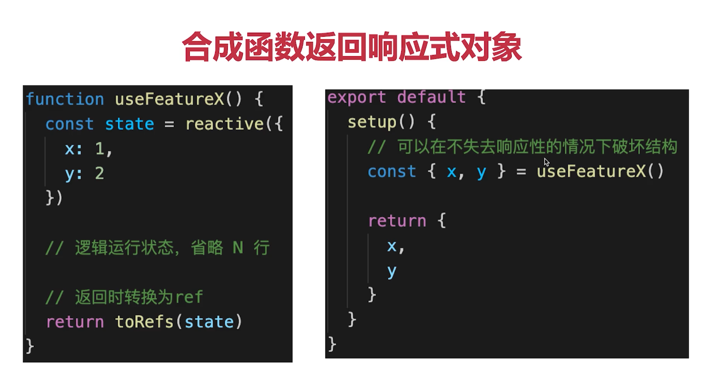

### 生命周期钩子函数
```text
1. 生命周期可以定义多个,去实现不同的逻辑
```
### 生命周期
```angular2html
beforeDestroy  beforeUnmount
destroyed    unmount
```

### 优势
```js
1/跟好的代码组织
2/更好的逻辑复用
3/更好的类型推导
```
### ref toRef  toRefs
```html
命名 用ref后缀  const name = 1; const nameRef = 2 
取值  用.value  nameRef.value = 3

+++++++++++++++++++++++++++++++++++++++++++++++++++++++++++++++++
toref
+++++++++++++++++++++++++++++++++++++++++++++++++++++++++++++++++
<!--toref 和toRefs 都是针对响应式数据使用的, 不是针对普通对象-->
toref针对响应式数据使用的
const state = reactive({name:'张三‘,age:20}); // 普通对象无效果
const nameRef = toRef(state, 'name');

+++++++++++++++++++++++++++++++++++++++++++++++++++++++++++++++++
toRefs
+++++++++++++++++++++++++++++++++++++++++++++++++++++++++++++++++
toRefs 将响应式对象(reactive封装)转换为普通对象 注意转换前提是响应式对象
对象的每一个prop都是对应的ref 两者保持引用关系

const state = reactive({name:'张三‘,age:20});
const stateRefs = toRefs(state); //相应式对象转换为普通对象

const {name:nameRef,age:ageRef} = stateRefs // 每个属性都是ref
return {ageRef, nameRef};
或者
return {stateRefs};
或者
return {state}
或者
return {...state}  // 注意 直接结构reactive 对象会失去响应式
```
### ref toRef  toRefs 最佳使用方式
##### 合成函数返回响应式对象


